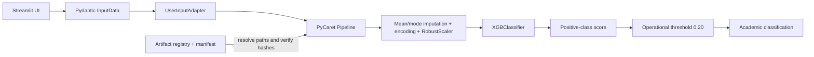

# Arquitectura de CardioHistory ML

**Clasificación explicable de antecedente autorreportado de infarto con datos
NHANES**

## 1. Propósito y alcance

La arquitectura implementa dos responsabilidades separadas:

1. inferencia con el artefacto desplegado identificado por el manifiesto;
2. experimentación académica para preparar datos y generar candidatos no
   desplegados.

El objetivo es la clase binaria asociada con `MCQ160E`: antecedente
autorreportado de infarto. El sistema no modela una condición actual ni un
evento futuro.

En inferencia, las responsabilidades se distribuyen de esta forma:

- **interfaz:** captura valores y presenta el resultado;
- **validación:** rechaza valores fuera del esquema y campos adicionales;
- **adaptación:** construye un `DataFrame` en el orden canónico;
- **registro de artefactos:** resuelve rutas, hashes y umbral;
- **preprocesamiento:** transforma las 27 entradas en 31 características;
- **inferencia:** obtiene el score correspondiente a la clase positiva `1`;
- **umbral:** aplica el valor operativo `0.20` del manifiesto;
- **presentación:** muestra una clasificación académica con sus límites.

## 2. Diagrama de componentes



El bloque `PyCaret Pipeline` agrupa el preprocesamiento serializado y el
estimador final. El diagrama los separa para hacer visible el flujo efectivo;
no representa servicios independientes.

## 3. Flujo efectivo de inferencia

```text
27 variables externas
→ validación Pydantic
→ orden canónico
→ pipeline PyCaret
→ 31 características transformadas
→ XGBClassifier
→ score de la clase 1
→ umbral 0.20
→ clasificación académica
```

El flujo comienza en `src/app.py`. `InputData` valida la entrada y configura
`extra="forbid"`; no se crean variables ausentes ni se aceptan campos
obsoletos. `UserInputAdapter` vuelca la entrada validada con el orden de
`MODEL_INPUT_FEATURES`. `PyCaretAdapter` conserva ese contrato, ejecuta
`predict_proba()` e identifica la columna asociada con la clase `1`.

El resultado binario se calcula comparando ese score con el umbral del
manifiesto. Cambiar el umbral modificaría la decisión, pero no reentrenaría el
pipeline.

## 4. Responsabilidad de los módulos

| Componente | Responsabilidad efectiva |
|---|---|
| `src/app.py` | Construye la interfaz Streamlit, carga el despliegue mediante el registro, recoge las 27 entradas y presenta score y clasificación con advertencias de alcance. |
| `src/interfaces.py` | Define el protocolo `HeartDiseaseModel` y el esquema Pydantic `InputData`, incluidos tipos, rangos y dominios categóricos. |
| `src/adapters.py` | `UserInputAdapter` valida y ordena la entrada; `PyCaretAdapter` valida el contrato del pipeline y extrae el score de la clase positiva. |
| `src/feature_contract.py` | Es la fuente canónica del orden de 27 variables, grupos numérico/categórico, objetivo y edad mínima. |
| `src/artifact_registry.py` | Lee el manifiesto, resuelve rutas internas seguras, verifica SHA-256, carga PyCaret y comprueba metadatos externos y ausencia del objetivo en el estimador. |
| `src/candidate_registry.py` | Valida el manifiesto de candidato v1, relaciones cruzadas, rutas relativas, hashes y contratos; también coordina escrituras atómicas y selección reproducible. |
| `src/train_pycaret.py` | Prepara experimentos PyCaret sobre particiones de desarrollo, registra todos los candidatos y publica mediante staging candidatos fechados sin desplegarlos automáticamente. |
| `src/validate_external.py` | Separa los modos desplegado y candidato, verifica procedencia y produce un JSON principal enlazado por hash con un CSV mínimo de scores. |
| `src/evaluation.py` | Calcula métricas binarias a partir de etiquetas y scores ya obtenidos, valida el umbral y ofrece un intervalo de Wilson para recall. No aporta por sí solo evidencia del artefacto desplegado. |
| `src/model.py` | Implementa `XGBoostScratch`, un booster educativo simplificado para estudiar gradientes, Hessianos, hojas y ensamble aditivo. No es el estimador desplegado. |
| `src/tree/` | Contiene el árbol educativo, la pérdida logística de segundo orden y un alias compatible hacia `XGBoostScratch`. |
| `scripts/smoke_test.py` | Ejecuta una comprobación sintética de integridad, carga, contrato, score y umbral mediante las interfaces canónicas. |
| `models/model_manifest.json` | Identifica el modelo desplegado, configuración, hashes, datos históricos asociados, estado y umbral operativo. |

Otros módulos relevantes son `src/data_pipeline.py`, que valida y divide una
cohorte de modelado, y `src/validate_external.py`, que evalúa explícitamente una
cohorte aportada por el usuario. Ninguno forma parte del arranque de Streamlit.

## 5. Artefactos e integridad

El despliegue se define en `models/model_manifest.json`, no por búsqueda del
archivo `.pkl` más reciente. El manifiesto declara:

- `models/best_pipeline.pkl`, pipeline PyCaret serializado;
- `models/model_config.json`, espejo serializado del contrato de entrada;
- hashes SHA-256 del modelo y la configuración;
- identificador y estado del modelo;
- umbral operativo `0.20`;
- referencia al Parquet histórico asociado.

`load_deployed_artifacts(verify_hashes=True)` verifica modelo y configuración
antes de la carga. `load_validated_pycaret_pipeline()` usa el cargador de
PyCaret y comprueba el contrato del artefacto. El metadato externo generado por
PyCaret puede incluir `HeartDisease`; el registro normaliza exclusivamente ese
nombre y confirma por separado que no aparezca entre las 31 características del
estimador final.

Un hash detecta diferencias respecto del archivo registrado, pero no vuelve
seguro un pickle malicioso. Solo debe deserializarse el artefacto confiable del
repositorio. Un pickle externo puede ejecutar código durante su carga.

## 6. Preprocesamiento desplegado

La secuencia observada del artefacto desplegado incluye:

1. imputación numérica por media;
2. imputación categórica por moda;
3. codificación ordinal de `Sex`;
4. one-hot encoding de `Race`;
5. un paso residual sin columnas efectivas;
6. `RobustScaler`;
7. `XGBClassifier`.

El one-hot encoding explica la expansión neta de 27 a 31 características. El
escalamiento no suele ser necesario para árboles, pero forma parte del pipeline
serializado y debe conservarse para reproducir su inferencia.

## 7. Separación entre inferencia y entrenamiento

La aplicación puede ejecutar inferencia porque conserva el manifiesto, la
configuración y el pipeline desplegado. No requiere el Parquet para iniciar.

El entrenamiento es otro flujo. La preparación corregida combina componentes
NHANES por `SEQN`, restringe el objetivo a respuestas explícitas de `MCQ160E`,
excluye identificadores de los predictores y separa desarrollo y test antes de
ajustar imputación o modelo. Los candidatos se guardan bajo
`models/candidates/<timestamp>/` y no sustituyen el despliegue por defecto.

Cada directorio contiene un manifiesto v1, el pipeline, una copia de la
configuración, un sidecar de procedencia y `selection_report.json`. Todos los
componentes se construyen en un directorio temporal; el directorio final se
publica solo después de verificar rutas, contratos y hashes.

Al cargar un candidato se verifica el hash del sidecar de procedencia y se
conserva el digest del dataset de entrenamiento declarado dentro de él. El
dataset histórico no tiene que seguir disponible y, por tanto, no se afirma que
su archivo haya sido recalculado o revalidado durante esa carga.

La selección usa exclusivamente métricas de desarrollo. Elige el mayor recall
entre candidatos con `precision >= 0.40`; si ninguno cumple, elige el mayor
recall global. Los empates conservan el primer elemento del orden reproducible
recibido. El test protegido no participa en esa decisión.

El Parquet histórico `data/02_intermediate/process_data.parquet` se conserva
para trazabilidad del artefacto desplegado. No representa la cohorte corregida y
no debe emplearse como base de un nuevo entrenamiento. Aunque existe código para
preparar datos y entrenar candidatos, la procedencia y las decisiones del
entrenamiento histórico no están documentadas con detalle suficiente para
reproducir exactamente el pickle desplegado.

## 8. Validación técnica de cohortes

`src/validate_external.py` usa el manifiesto desplegado por defecto o exige
`--candidate-manifest` para un candidato. `--model-path` está obsoleto y se
rechaza para impedir la carga directa de pickles arbitrarios. No hay umbral
implícito: se usa el valor del manifiesto o un override explícito registrado.

Un sidecar externo v1 enlaza criptográficamente el dataset y puede declarar
fuente, filas, columnas, contrato, objetivo MCQ160E e independencia respecto del
entrenamiento. `external_independent` significa que la declaración está enlazada
al archivo evaluado; no significa que el programa haya auditado esa
independencia. Sin sidecar, el scope es `external_unverified`.

La salida principal JSON registra identidad, integridad, procedencia, umbral,
métricas y advertencias. El CSV relacionado contiene solo `row_id`, score de la
clase positiva, umbral y clase predicha. Ambos se preparan en staging; el JSON se
publica al final y contiene nombre y SHA-256 del CSV.

## 9. Niveles de verificación

### Pruebas no integradas

```powershell
python -m pytest -q -m "not integration"
```

Cubren contratos, adaptadores, registro, procesamiento, métricas y la
implementación educativa sin exigir la carga completa del artefacto real.

### Pruebas de integración

```powershell
python -m pytest -q -m integration
```

Cargan el pipeline real, verifican sus metadatos y las 31 características del
estimador, ejecutan `predict()`/`predict_proba()` con 27 entradas y comprueban el
arranque de Streamlit.

### Smoke test

```powershell
python scripts/smoke_test.py
```

Es la verificación operativa mínima de extremo a extremo. Usa una fila sintética,
comprueba hashes antes de deserializar, valida orden y dimensionalidad, obtiene
un score finito en `[0, 1]` y aplica el umbral del manifiesto.

Estos tres niveles verifican funcionamiento técnico. No sustituyen una
evaluación predictiva en una partición independiente.

## 10. Decisiones y limitaciones

- PyCaret se conserva como orquestador del pipeline serializado.
- XGBoost es el estimador final desplegado; `XGBoostScratch` es solo didáctico.
- El contrato externo tiene exactamente 27 variables y orden estricto.
- El estimador recibe 31 características después del preprocesamiento.
- El umbral operativo `0.20` está definido en el manifiesto y no cuenta con
  validación independiente demostrada.
- No hay evidencia reproducible suficiente para comparar este artefacto con
  candidatos y declararlo superior.
- La compatibilidad de un pickle depende de versiones de Python y bibliotecas;
  el entorno actualmente comprobado es Python 3.10.20.
- No se han demostrado calibración, transporte poblacional ni equidad.
- La arquitectura no contiene API HTTP propia, base de datos ni microservicios;
  Streamlit ejecuta el flujo local en un solo proceso.
